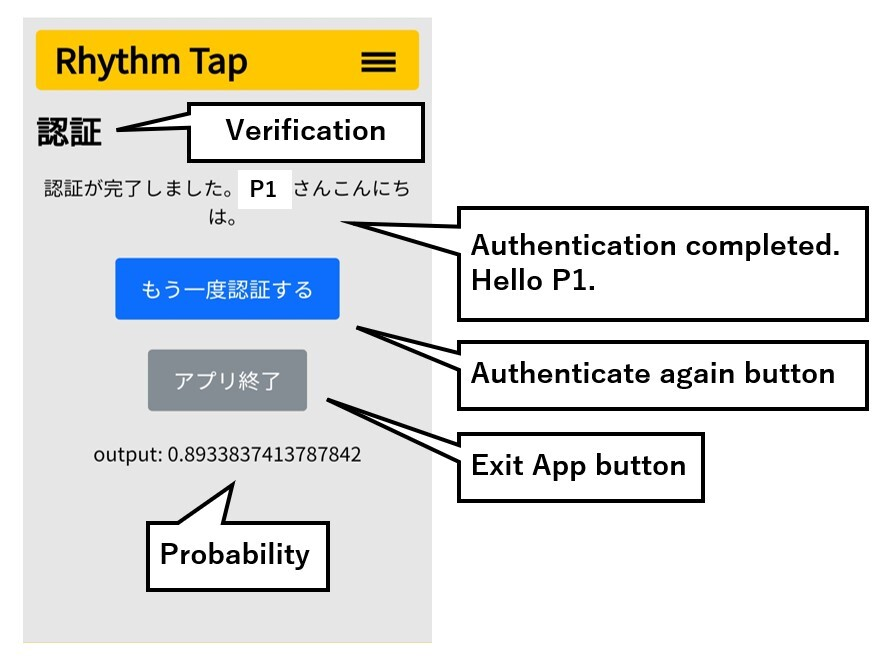

# Rhythm Tap Authentication

"Rhythm Tap" is a new authentication system that uses an individual's sense of rhythm. We aim to improve accessibility and convenience by using users' tapping patterns as biometric authentication. It was implemented on the Android platform and its effectiveness and usability was evaluated through a comprehensive user study including visually impaired and sighted participants. Rhythm Tap is easy to use, accurate, and shows potential as a secure and user-friendly authentication method.


## How to Use

### Set Up

1. Edit ".env" file
    - PJ_NAME
	- port number

    e.g.
    ```
    PJ_NAME=rhythm_tap

    WEB_PORT=1045
    PHPMYADMIN_PORT=1145
    DB_PORT=1245
    ```

1. Run the command `docker-compose up -d --build`

1. Connect your Android smartphone to the same Wi-Fi as your PC

1. Check your PC's local IP

1. Access to `https://{PC's local IP}:{WEB_PORT}`


### Regist Rhythm Data

1. (arbitrary) Edit `dir_name` on line 18 of `src/myapp/regist.py` (You can specify where the rhythm data will be saved)

1. Press the “登録” button (green) from the top page

1. Register according to the image description


### Train Model

1. Collect data from multiple people for learning (in one directory)

1. (arbitrary) If you specified the location where the rhythm data will be saved in the previous chapter, edit `data_dir` on line 10 of `src/deeplearning/train_personal.py` (You can specify where the rhythm data will be saved)

1. Edit `personal_name` on line 23 of `src/deeplearning/train_personal.py` with the name of the person you want to create the model for

1. Run the command `python ./src/deeplearning/train_personal.py`

1. The learning log including the model will be saved under the directory `src/deeplearning/`


### Authentication

1. Create a new directory under the directory `src/deeplearning/` (preferably named `log_*`)

1. Move the directory (Tthe learning log including the model, named like `log_user_20230808_084259`) to the new directory you created

1. Edit `model_dir_name` on line 409 of `src/myapp/auth.py` with the new directory you created

1. (arbitrary) Edit `tmp_dir_name` on line 408 of `src/myapp/auth.py` (You can specify where the rhythm data during authentication will be saved)

1. Authentication according to the image description



